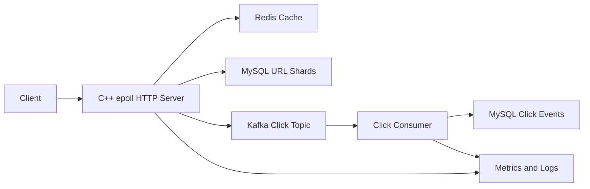

# C++ URL Shortener System

A production-style C++ short URL service evolved from the classic TinyWebServer project.

It keeps the original epoll-based networking core and rebuilds the application layer around REST APIs, Redis caching, Kafka click events, sharded MySQL storage, Prometheus metrics, and structured logs.

## Architecture



## What It Covers

- Short URL creation and `302` redirect APIs.
- Snowflake ID to Base62 short code generation.
- Redis Cache-Aside with Bloom Filter, singleflight rebuild, and TTL jitter.
- Kafka click pipeline: request path bounded-enqueues owned events; background
  produce/poll. Queue-full drops are counted (not zero-loss). Idempotent consumer writes.
- Thin C++ sharding router over MySQL: `short_code` hash to `4 DB x 4 tables`.
- Prometheus metrics for QPS, P99 latency, cache hit ratio, Kafka publish status, and consumer lag.
- JSONL structured access logs.

## Repository Layout

```text
analytics/       Kafka click producer
consumer/        Python click consumer with lag metrics
handler/         /health, /metrics, and short URL handlers
http/            HTTP parsing, routing, and response serialization
observability/   Prometheus metrics and structured access logs
shorturl/        Base62, Snowflake, Redis cache, sharding, repository
sql/             MySQL schema and sharding scripts
docs/            Chinese phase-by-phase design notes
config/          YAML configuration
```

## Quick Start

Install dependencies, initialize MySQL, start Redis and Kafka, then build:

```bash
cmake -S . -B build-linux -DCMAKE_CXX_COMPILER=/usr/bin/g++
cmake --build build-linux
./build-linux/server config/config.yaml
```

Run the click consumer in another terminal:

```bash
python3 consumer/click_consumer.py
```

The default local setup expects:

- MySQL at `127.0.0.1:3306`
- Redis at `127.0.0.1:6379`
- Kafka at `127.0.0.1:9092`
- Server at `127.0.0.1:9006`
- Consumer metrics at `127.0.0.1:9108`

SQL scripts live in [sql](sql), and runtime settings live in [config/config.yaml](config/config.yaml).

## API

```bash
curl http://127.0.0.1:9006/health

curl -X POST http://127.0.0.1:9006/api/shorten \
  -H 'Content-Type: application/json' \
  -d '{"long_url":"https://example.com"}'

curl -i http://127.0.0.1:9006/<short_code>
```

## Observability

```bash
curl http://127.0.0.1:9006/metrics
curl http://127.0.0.1:9108/metrics
tail -f logs/access.jsonl
```

Key metrics:

- `shorturl_http_requests_total`
- `shorturl_http_request_duration_seconds_bucket`
- `shorturl_cache_requests_total`
- `shorturl_kafka_publish_total`
- `shorturl_kafka_consumer_lag`

## Documentation

The detailed phase documents are intentionally kept in Chinese:

- [Phase 1: single-node short URL and baseline benchmark](docs/phase1_baseline.md)
- [Phase 2: Redis cache consistency](docs/phase2_cache_consistency.md)
- [Phase 3: Kafka reliable delivery](docs/phase3_kafka_delivery.md)
- [Phase 4: MySQL sharding](docs/phase4_sharding.md)
- [Phase 5: observability](docs/phase5_observability.md)

## Credits

Original project: [qinguoyi/TinyWebServer](https://github.com/qinguoyi/TinyWebServer)
