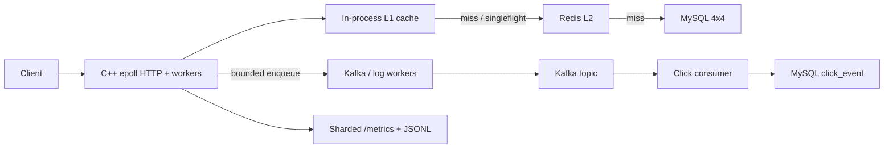

# C++ URL Shortener

A production-style C++ short URL service evolved from
[qinguoyi/TinyWebServer](https://github.com/qinguoyi/TinyWebServer).

The networking core is still a single main-thread epoll loop plus a worker
pool. The application layer is REST short-URL create/redirect, with Redis as
an L2 adapter, a 4×4 MySQL shard router, Kafka click events, Prometheus
metrics, and JSONL access logs.

Optimization PRs [#1](https://github.com/CChen19/cpp-url-shortener/pull/1)–[#7](https://github.com/CChen19/cpp-url-shortener/pull/7)
are on `master`. This tree also has the Release `sigaction` and Kafka worker
`poll` fixes described below.

## Architecture



Hot `GET /{code}` is meant to be: L1 hit → 302, then enqueue click + access
log. Redis, MySQL, Kafka produce/poll, and file I/O stay off that path when
the key is already in L1.

## Behavior that matters

- **Cache TTL ≠ business expiry.** Cached values carry `expire_at`. A TTL miss
  refills. An expired mapping is **410**, never a stale **302**.
- **Clicks** are server-processed redirects, not proof the client loaded the
  destination. Redirect does not wait for Kafka. Queue-full drops are counted.
- Bloom is a **hint** by default (`bloom_hard_filter: false`), not a hard 404.
- Redis down: L1 still serves hot keys; origin MySQL is **capped** (else 503).
  A background PING can restore Redis without a process restart.
- One I/O model: `actor_model=1` is coerced to 0. C++14.

## What landed (optimization program)

| Phase | PR | What |
|-------|----|------|
| 0 | [#1](https://github.com/CChen19/cpp-url-shortener/pull/1) | Fixed-rate harness; do not follow 302; `pages/min` ≠ QPS |
| 1a | [#2](https://github.com/CChen19/cpp-url-shortener/pull/2) | On-demand MySQL, acquire timeout, queue-full 503 |
| 1b | [#3](https://github.com/CChen19/cpp-url-shortener/pull/3) | Single I/O model, connection generations |
| 1c | [#4](https://github.com/CChen19/cpp-url-shortener/pull/4) | Strict Content-Length, no TE/CE, Location safety, joinable shutdown |
| 2 | [#5](https://github.com/CChen19/cpp-url-shortener/pull/5) | Sharded L1 + `expire_at`, shared singleflight, soft Bloom |
| 3 | [#6](https://github.com/CChen19/cpp-url-shortener/pull/6) | Redis pool + probe; Kafka/log bounded queues |
| 4 | [#7](https://github.com/CChen19/cpp-url-shortener/pull/7) | Sharded `MetricsRegistry` (in-process evidence; no invented QPS) |

Assumptions: [docs/business_assumptions.md](docs/business_assumptions.md).

## Repository layout

```text
analytics/       Kafka click producer (request path = enqueue only)
consumer/        Python click consumer
handler/         /health, /metrics, /api/shorten, GET /{code}
http/            HTTP parse, route, response
observability/   Sharded Prometheus registry + structured logs
shorturl/        Base62, Snowflake, L1/L2 cache, singleflight, shards
sql/             MySQL schema and 4×4 shard scripts
test_pressure/   Phase 0 fixed-rate harness
docs/            Design notes + measured laptop run
config/          YAML
```

## Quick start

MySQL and Redis are required for create/redirect. Kafka is optional for 302
(clicks fail in metrics if the broker is down).

```bash
# Ubuntu/WSL packages + your usual redis++ / librdkafka / yaml-cpp / mysqlclient
sudo service mysql start
sudo service redis-server start

mysql -h127.0.0.1 -ushorturl -pshorturl shorturl < sql/001_short_url.sql
mysql -h127.0.0.1 -ushorturl -pshorturl shorturl < sql/002_click_event.sql
# 4×4 shards: run sql/003_sharded_short_url.sql as a privileged user if needed

cmake -S . -B build-linux -DCMAKE_BUILD_TYPE=Release -DCMAKE_CXX_COMPILER=/usr/bin/g++
cmake --build build-linux -j
./build-linux/server config/config.yaml
```

```bash
python3 consumer/click_consumer.py   # optional
```

Defaults: MySQL `127.0.0.1:3306`, Redis `127.0.0.1:6379`, Kafka `127.0.0.1:9092`,
server `127.0.0.1:9006`, consumer metrics `127.0.0.1:9108`.

**Release builds before the `addsig` fix died after 5 seconds** (`Alarm clock`):
`assert(sigaction(...))` is deleted under `NDEBUG`. Current `timer/lst_timer.cpp`
calls `sigaction` unconditionally.

## API

```bash
curl http://127.0.0.1:9006/health

curl -X POST http://127.0.0.1:9006/api/shorten \
  -H 'Content-Type: application/json' \
  -d '{"long_url":"https://example.com"}'

# Do not follow Location if you are measuring redirects
curl -i http://127.0.0.1:9006/<short_code>
```

## Observability

```bash
curl http://127.0.0.1:9006/metrics
curl http://127.0.0.1:9108/metrics
tail -f logs/access.jsonl
```

Useful names: `shorturl_http_requests_total`,
`shorturl_http_request_duration_seconds_bucket`, `shorturl_cache_requests_total`,
`shorturl_kafka_enqueue_total`, `shorturl_kafka_produce_total`,
`shorturl_kafka_delivery_total`, `shorturl_log_enqueue_total`.

## Load test (honest)

Primary driver is **fixed arrival rate**, not webbench. The driver does **not**
follow `302`. webbench `pages/min` is not QPS.

```bash
./test_pressure/run_scenarios.sh --dry-run
./test_pressure/run_scenarios.sh --rate 200 --duration 15s
```

Filled runs on this repo’s Windows gaming laptop (WSL2, Ryzen 7 5800H) are in
[docs/laptop_wsl2_experiment.md](docs/laptop_wsl2_experiment.md) and
[docs/phase0_baseline.md](docs/phase0_baseline.md). Not a server rating.

- **MySQL + Redis, Kafka down:** 200 req/s × 15s was 3000×302 on hot/uniform/zipf/herd
  (P99 ~1.0–1.2 ms). Expired codes stayed 410. At 500 req/s hot the laptop slipped
  (493.7 302/s, one timeout).
- **MySQL + Redis + native Kafka 3.7.2 + click consumer:** same 200 req/s shape
  (P99 still ~1 ms). Hot **500 req/s held 7500×302**, P99 0.873 ms. Click enqueue
  drops 0; the Python consumer lagged (visible on `:9108`). Redirects did not wait.

Docker Desktop’s engine was not running here; Kafka was started from the Apache
tarball (KRaft), not `docker run`.

## Tests

```bash
cd build-linux && ctest --output-on-failure
```

## Documentation

Optimization / measurement (English):

- [Business assumptions](docs/business_assumptions.md)
- [Phase 0 harness](docs/phase0_baseline.md)
- [Laptop / WSL2 experiment](docs/laptop_wsl2_experiment.md)
- [Phase 4 metrics shards](docs/phase4_measured_metrics.md)

Original product notes (Chinese):

- [Phase 1 baseline](docs/phase1_baseline.md)
- [Phase 2 cache](docs/phase2_cache_consistency.md)
- [Phase 3 Kafka](docs/phase3_kafka_delivery.md)
- [Phase 4 sharding](docs/phase4_sharding.md)
- [Phase 5 observability](docs/phase5_observability.md)

## Credits

Original project: [qinguoyi/TinyWebServer](https://github.com/qinguoyi/TinyWebServer)
