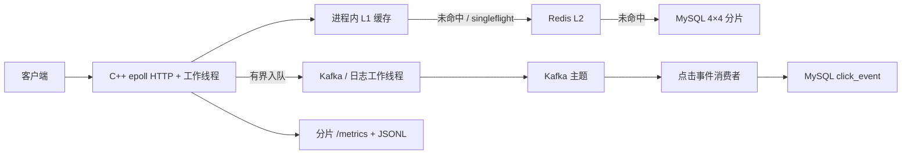

# C++ 短链接服务

[English](README.md) | 简体中文

这是一个从 [qinguoyi/TinyWebServer](https://github.com/qinguoyi/TinyWebServer) 演进而来的、面向生产场景的 C++ 短链接服务。

网络核心仍采用单主线程 epoll 事件循环与工作线程池。应用层提供短链接创建与跳转 REST API，并使用 Redis 作为 L2 缓存、4×4 MySQL 分片路由存储数据、Kafka 传递点击事件、Prometheus 采集指标，同时输出 JSONL 访问日志。

优化 PR [#1](https://github.com/CChen19/cpp-url-shortener/pull/1) 至 [#7](https://github.com/CChen19/cpp-url-shortener/pull/7) 已合入 `master`。当前代码还包含下文所述的 Release 模式 `sigaction` 修复和 Kafka 工作线程 `poll` 修复。

## 架构



热门 `GET /{code}` 请求的预期路径为：L1 命中 → 返回 302 → 将点击事件和访问日志放入队列。只要键已在 L1 中，Redis、MySQL、Kafka 的 produce/poll 操作以及文件 I/O 都不会进入这条热路径。

## 重要行为约定

- **缓存 TTL 不等于业务过期时间。** 缓存值携带 `expire_at`；TTL 未命中时会重新填充。业务上已过期的映射始终返回 **410**，绝不会返回过期的 **302**。
- **点击量**表示服务端已处理跳转，并不能证明客户端成功加载了目标页面。跳转不会等待 Kafka；队列已满导致的丢弃会被计数。
- Bloom 过滤器默认只提供**提示**（`bloom_hard_filter: false`），不会直接判定并返回 404。
- Redis 不可用时，L1 仍可处理热门键；对源站 MySQL 的访问设有上限，超过上限返回 503。后台 PING 探测可在不重启进程的情况下恢复 Redis。
- 项目仅保留一种 I/O 模型：`actor_model=1` 会被强制转换为 0。使用 C++14。

## 已完成的优化

| 阶段 | PR | 内容 |
|------|----|------|
| 0 | [#1](https://github.com/CChen19/cpp-url-shortener/pull/1) | 固定速率压测工具；不跟随 302；`pages/min` 不等于 QPS |
| 1a | [#2](https://github.com/CChen19/cpp-url-shortener/pull/2) | 按需访问 MySQL、连接获取超时、队列已满时返回 503 |
| 1b | [#3](https://github.com/CChen19/cpp-url-shortener/pull/3) | 统一 I/O 模型、连接代次管理 |
| 1c | [#4](https://github.com/CChen19/cpp-url-shortener/pull/4) | 严格校验 Content-Length、禁用 TE/CE、保证 Location 安全、支持可等待的安全退出 |
| 2 | [#5](https://github.com/CChen19/cpp-url-shortener/pull/5) | 分片 L1、`expire_at`、共享 singleflight、软 Bloom 过滤 |
| 3 | [#6](https://github.com/CChen19/cpp-url-shortener/pull/6) | Redis 连接池与探测、Kafka/日志有界队列 |
| 4 | [#7](https://github.com/CChen19/cpp-url-shortener/pull/7) | 分片 `MetricsRegistry`（提供进程内证据，不虚构 QPS） |

相关假设见[业务假设](docs/business_assumptions.md)。

## 仓库结构

```text
analytics/       Kafka 点击事件生产者（请求路径只负责入队）
consumer/        Python 点击事件消费者
handler/         /health、/metrics、/api/shorten、GET /{code}
http/            HTTP 解析、路由与响应
observability/   分片 Prometheus 指标与结构化日志
shorturl/        Base62、Snowflake、L1/L2 缓存、singleflight、分片
sql/             MySQL 表结构与 4×4 分片脚本
test_pressure/   阶段 0 固定速率压测工具
docs/            设计说明与笔记本实测记录
config/          YAML 配置
```

## 快速开始

创建短链接和执行跳转需要 MySQL 与 Redis。Kafka 对 302 跳转不是必需的；Broker 不可用时，点击事件发送失败会体现在指标中。

```bash
# Ubuntu/WSL 依赖，以及常规的 redis++ / librdkafka / yaml-cpp / mysqlclient
sudo service mysql start
sudo service redis-server start

mysql -h127.0.0.1 -ushorturl -pshorturl shorturl < sql/001_short_url.sql
mysql -h127.0.0.1 -ushorturl -pshorturl shorturl < sql/002_click_event.sql
# 4×4 分片：如有需要，请使用具备相应权限的用户执行 sql/003_sharded_short_url.sql

cmake -S . -B build-linux -DCMAKE_BUILD_TYPE=Release -DCMAKE_CXX_COMPILER=/usr/bin/g++
cmake --build build-linux -j
./build-linux/server config/config.yaml
```

```bash
python3 consumer/click_consumer.py   # 可选
```

默认地址：MySQL `127.0.0.1:3306`、Redis `127.0.0.1:6379`、Kafka `127.0.0.1:9092`、服务端 `127.0.0.1:9006`、消费者指标 `127.0.0.1:9108`。

**修复 `addsig` 之前的 Release 构建会在 5 秒后因 `Alarm clock` 退出**：`assert(sigaction(...))` 在定义 `NDEBUG` 时会被删除。当前 `timer/lst_timer.cpp` 已改为无条件调用 `sigaction`。

## API

```bash
curl http://127.0.0.1:9006/health

curl -X POST http://127.0.0.1:9006/api/shorten \
  -H 'Content-Type: application/json' \
  -d '{"long_url":"https://example.com"}'

# 测量跳转性能时不要跟随 Location
curl -i http://127.0.0.1:9006/<short_code>
```

## 可观测性

```bash
curl http://127.0.0.1:9006/metrics
curl http://127.0.0.1:9108/metrics
tail -f logs/access.jsonl
```

常用指标包括：`shorturl_http_requests_total`、`shorturl_http_request_duration_seconds_bucket`、`shorturl_cache_requests_total`、`shorturl_kafka_enqueue_total`、`shorturl_kafka_produce_total`、`shorturl_kafka_delivery_total` 和 `shorturl_log_enqueue_total`。

## 可信压测

主要压测工具采用**固定请求到达速率**，而不是 webbench。该工具不会跟随 `302`；webbench 的 `pages/min` 也不等同于 QPS。

```bash
./test_pressure/run_scenarios.sh --dry-run
./test_pressure/run_scenarios.sh --rate 200 --duration 15s
```

Windows 游戏本（WSL2）上的实测记录见[笔记本 / WSL2 实验](docs/laptop_wsl2_experiment.md)和[阶段 0 基线](docs/phase0_baseline.md)。这些数据不能视为服务器性能评级。

- **MySQL + Redis，Kafka 不可用：**以 200 请求/秒运行 15 秒时，hot、uniform、zipf、herd 场景均完成 3000 次 302 跳转（P99 约为 1.0～1.2 ms），过期短码始终返回 410。热门键达到 500 请求/秒时，该笔记本开始无法维持目标速率（实际 493.7 次 302/秒，并发生一次超时）。
- **MySQL + Redis + 原生 Kafka 3.7.2 + 点击事件消费者：**在 200 请求/秒下结果相近（P99 仍约为 1 ms）；热门键在 **500 请求/秒**下完成 **7500 次 302 跳转**，P99 为 0.873 ms。点击事件入队丢弃数为 0，但 Python 消费者出现积压，可在 `:9108` 指标中观察到。跳转请求不会等待消费者。

测试环境中的 Docker Desktop 引擎未运行，因此 Kafka 使用 Apache tarball 以 KRaft 模式启动，而非通过 `docker run` 启动。

## 测试

```bash
cd build-linux && ctest --output-on-failure
```

## 文档

优化与测量文档（英文）：

- [业务假设](docs/business_assumptions.md)
- [阶段 0 压测工具](docs/phase0_baseline.md)
- [笔记本 / WSL2 实验](docs/laptop_wsl2_experiment.md)
- [阶段 4 指标分片](docs/phase4_measured_metrics.md)

原始产品说明（中文）：

- [阶段 1 基线](docs/phase1_baseline.md)
- [阶段 2 缓存](docs/phase2_cache_consistency.md)
- [阶段 3 Kafka](docs/phase3_kafka_delivery.md)
- [阶段 4 分片](docs/phase4_sharding.md)
- [阶段 5 可观测性](docs/phase5_observability.md)

## 致谢

原始项目：[qinguoyi/TinyWebServer](https://github.com/qinguoyi/TinyWebServer)
